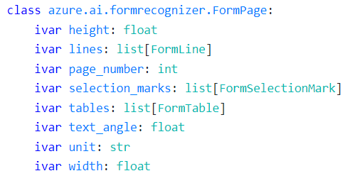
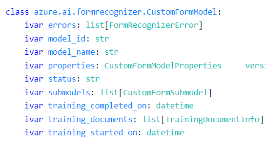
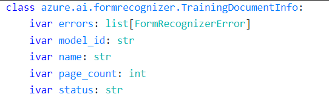
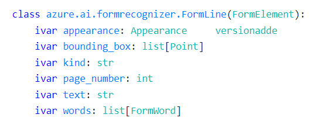
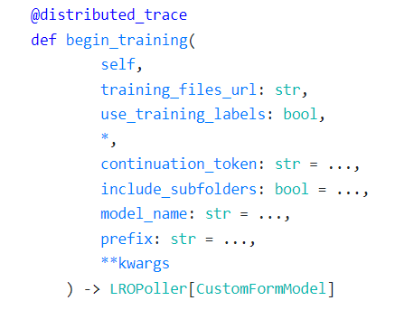
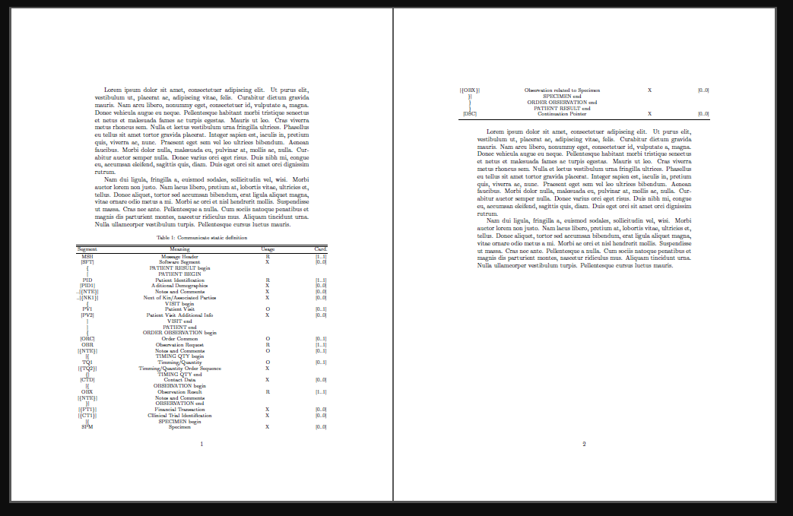
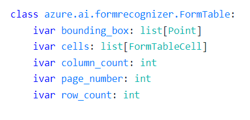
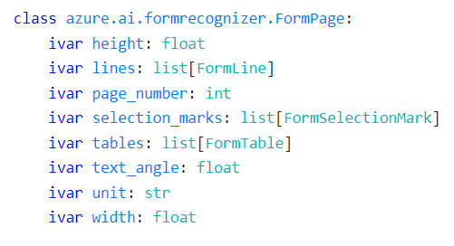
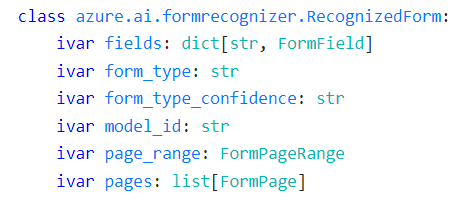
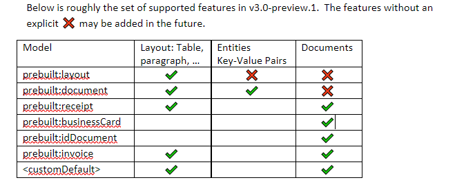

# V3: changes that we're unable to mitigate in SDKs


### 1) v3.0 defaults to "natural" reading order with no option to choose "basic" (top-down, left-right) order (v2.1 default)

In Paul's words:

> Initially, the ordering of lines is computed using a predictable top-down, left-right heuristic.  To support customer requests, we need to support a more natural reading order that reflect the visual structure of the page content.  Although the new natural reading order behavior is what most customers want, it would constitute a breaking change.  Thus in v2.1, we supported via an optional readingOrder request parameter that defaults to the original basic reading order that we want to deprecate.  To reduce developer confusion and design surface in v3.x, we would like to remove the readingOrder parameter and always return the page content in reading order. 

For the SDK, this means that the order of `lines` returned in a document will be different in v3.0 than the order returned in v2.1.
If a customer wrote any logic based on the order of lines in the old library, this would now break for them when adopting v3.0.



```python
from azure.core.credentials import AzureKeyCredential
from azure.ai.formrecognizer import FormRecognizerClient

endpoint = os.environ["AZURE_FORM_RECOGNIZER_ENDPOINT"]
key = os.environ["AZURE_FORM_RECOGNIZER_KEY"]

form_recognizer_client = FormRecognizerClient(endpoint=endpoint, credential=AzureKeyCredential(key))
with open(path_to_sample_forms, "rb") as f:
    poller = form_recognizer_client.begin_recognize_content(form=f)
form_pages = poller.result()

for idx, content in enumerate(form_pages):
    for line_idx, line in enumerate(content.lines):  # ordering of lines returned is different for v3.0 vs v2.1
        print("Line # {} has word count '{}' and text '{}' within bounding box '{}'".format(
            line_idx,
            len(line.words),
            line.text,
            format_bounding_box(line.bounding_box)
        ))
```

### 2) Training documents information no longer returned after building a model in v3.0
We used to return a list of TrainingDocumentInfo on the model type returned from training a custom model. This information
is no longer returned in v3.0 and would lead to us needing to return an empty list or an object with very little populated (maybe just model_id?)





```python
from azure.ai.formrecognizer import FormTrainingClient
from azure.core.credentials import AzureKeyCredential

endpoint = os.environ["AZURE_FORM_RECOGNIZER_ENDPOINT"]
key = os.environ["AZURE_FORM_RECOGNIZER_KEY"]
container_sas_url = os.environ["CONTAINER_SAS_URL"]

form_training_client = FormTrainingClient(endpoint, AzureKeyCredential(key))
poller = form_training_client.begin_training(
    container_sas_url, model_name="mymodel"
)
model = poller.result()

# Custom model information
print("Model ID: {}".format(model.model_id))
print("Status: {}".format(model.status))
print("Model name: {}".format(model.model_name))
print("Is this a composed model?: {}".format(model.properties.is_composed_model))
print("Training started on: {}".format(model.training_started_on))
print("Training completed on: {}".format(model.training_completed_on))

# Training result information no longer returned
# for doc in model.training_documents:
#     print("Document name: {}".format(doc.name))
#     print("Document status: {}".format(doc.status))
#     print("Document page count: {}".format(doc.page_count))
#     print("Document errors: {}".format(doc.errors))

```


### 2) Style is no longer tied to a line
Style used to be returned on a line in the response and so we exposed this as an Appearance on FormLine in the SDK.
It is now a top-level attribute of the entire analyze result and spans are used to understand the text (line, word, etc)
which has the particular style.



```json
{
    "status": "succeeded",
    "createdDateTime": "2021-08-05T01:47:55Z",
    "lastUpdatedDateTime": "2021-08-05T01:48:03Z",
    "analyzeResult": {
      "apiVersion": "2021-07-30-preview",
      "modelId": "prebuilt-receipt",
      "stringIndexType": "textElements",
      "content": "Contoso\nContoso\n123 Main Street\nRedmond, WA 98052\n987-654-3210\n6/10/2019 13:59\nSales Associate: Paul\n1 Cappuccino\n$2.20\n1 BACON & EGGS",
      "pages": [
        {
          "pageNumber": 1,
          "angle": 1.4879,
          "width": 8.5,
          "height": 11,
          "unit": "inch",
          "words": [...],
          "lines": [...]
        }
      ],
      "styles": [
        {
          "isHandwritten": true,
          "confidence": 0.9,
          "spans": [
            {
              "offset": 188,
              "length": 7
            }
          ]
        }
      ]
    }
}
```


### 5) v3.0 deprecates unsupervised training
We made `use_training_labels` a required parameter in begin_training. 



```python
from azure.ai.formrecognizer import FormTrainingClient
from azure.core.credentials import AzureKeyCredential

endpoint = os.environ["AZURE_FORM_RECOGNIZER_ENDPOINT"]
key = os.environ["AZURE_FORM_RECOGNIZER_KEY"]
container_sas_url = os.environ["CONTAINER_SAS_URL"]

form_training_client = FormTrainingClient(endpoint, AzureKeyCredential(key))
poller = form_training_client.begin_training(
    container_sas_url, use_training_labels=True  # required, positional param :(
)
model = poller.result()
```

The new build document model API also includes the `model_id` and `technique` as required parameters. We could maybe set
these in the SDK... need to understand that better.

We could deprecate this method and introduce a new `build_model()` method...

```python
from azure.ai.formrecognizer import FormTrainingClient
from azure.core.credentials import AzureKeyCredential

endpoint = os.environ["AZURE_FORM_RECOGNIZER_ENDPOINT"]
key = os.environ["AZURE_FORM_RECOGNIZER_KEY"]
container_sas_url = os.environ["CONTAINER_SAS_URL"]

form_training_client = FormTrainingClient(endpoint, AzureKeyCredential(key))
poller = form_training_client.begin_build_model(
    source=container_sas_url, technique="fixedTemplate-2021-07-30"
)
model = poller.result()

# Custom model information
print("Model ID: {}".format(model.model_id))

print("Recognized doc types:")
for doc_type, fields in model.doc_types.items():
    print("Doc type {} can recognize fields:".format(doc_type))
    for name, field in fields.field_schema.items():  # should confidence be at this level?
        print("Name: {}, type: {}".format(name, field.type))
    for name, confidence in fields.field_confidence.items():
        print("Name: {}, confidence: {}".format(name, confidence))
```


### 6) v3.0 removes form elements (words, lines, selection marks) and provides spans to access the content
While I _think_ we can technically map the spans with the content back to the lines, words, etc this will take some extra effort to map
correctly. Additionally, lines used to contain words and now these two have been separated into their own lists in the response.
While we can index into the content directly to get the text, we will need to search the words, lines, etc to get the rest of 
the information (page number, confidence, etc) to populate our existing model types FormWord, FormLine, FormSelectionMark.

### 6a) v3.0 deprecates `includeFieldElements`.
We used `includeFieldElements` as an optional paramerter in API's to include the element references in the recognition result.
With v3.0 `includeFieldElements` would be defaulted to be `true`. In doing so, the service always returns the span information which can be then translated/computed to the element references.
This potentially could be a behavioral breaking change for customers thinking of it as an "opt-in" feature.

### 7) v3.0 will support cross-page elements leading to bounding regions instead of bounding boxes
A cross-page element might be something like a table that spans across two pages like this:



Our FormTable type that represents a table in a document has only a bounding box property:



We could add bounding_region next to bounding box, but will probably lead to a lot of confusion for which to use.

```json
{
    "page":1,
    "boundingBox": [...],
    "boundingRegions":[
      {"page": 1, "boundingBox": [...]},
      {"page": 2, "boundingBox": [...]},
    ]
}
```

Additionally, since we put `tables` under pages it calls into question which page the table should fall under?



### 7a) Cross page elements mean that pages can't be accurately tied to documents
In our design we'd take the page range of a document result and then populate the corresponding pages under the `pages`
property. Seeing as v3.0 will have cross-page elements, including the support for multiple documents per page (e.g. license
and passport on one page), we can't accurately return the pages for a document anymore (they may include other information
not pertaining to the document).




### 8) Plan to add a new prebuilt model every month. Our SDK surface area will grow out of control.
In Python, we add 2 new client methods for every prebuilt model added (url and file stream input).
We could deprecate the existing prebuilt methods and include the new method which takes the modelID/prebuilt ID as
input. 


### 9) v3.0 may in the future return both key-value pairs and documents for a document



This matters to the SDK because we currently take the key-value pairs **or** the `fields` from documents to populate
the `fields` property on `RecognizedForm`. Previously there was a difference between unsupervised/supervised results, and 
we could massage one or the other into `fields`. In v3.0+ if _both_ key value pairs and document fields were returned we 
would need to decide which would get populated as `fields` and possibly add a new `key_value_pair` property on
`RecognizedForm`.

### 10) v3.0 makes the field schema programmatically accessible and SDK can leverage this to strongly type prebuilt/custom model fields


### 11) Change in structural representation of the visual elements.
With v3.0, service has seperated the visual elements into their respective lists.
```json
 List of words in page
      "words": [
        {
          "text": "CONTOSO",            
          "boundingBox": [ ... ],       
          "confidence": 0.99,           
          "span": { ... }               
        }, ...
      ],

      // List of selectionMarks in page
      "selectionMarks": [
        {
          "state": "selected",          
          "boundingBox": [ ... ],       
          "confidence": 0.95,           
          "span": { ... }               
        }, ...
      ],

      // List of lines in page
      "lines": [
        {
          "content": "CONTOSO LTD.",    
          "boundingBox": [ ... ],       
          "spans": [ ... ],             
        }, ...
      ]
```
Currently, the SDK's represent a hierarchical association between the visual elements present on the form. For ex, FormLines to consist of FormWords. 
[Service Question]
Would it be a correct representation moving forward with additional elements in picture?

### 12) isHeader/isFooter -> rowHeader, rowFooter, columnHeader, columnFooter
Service v3.0, does not support binary header or footer specification for a  `FormTableCell. 
Since, SDK's already expose this as a binary property we could have additive values to support `{rowHeader, rowFooter, columnHeader, columnFooter}` and also map it to the already existing `isHeader/isFooter` properties.
